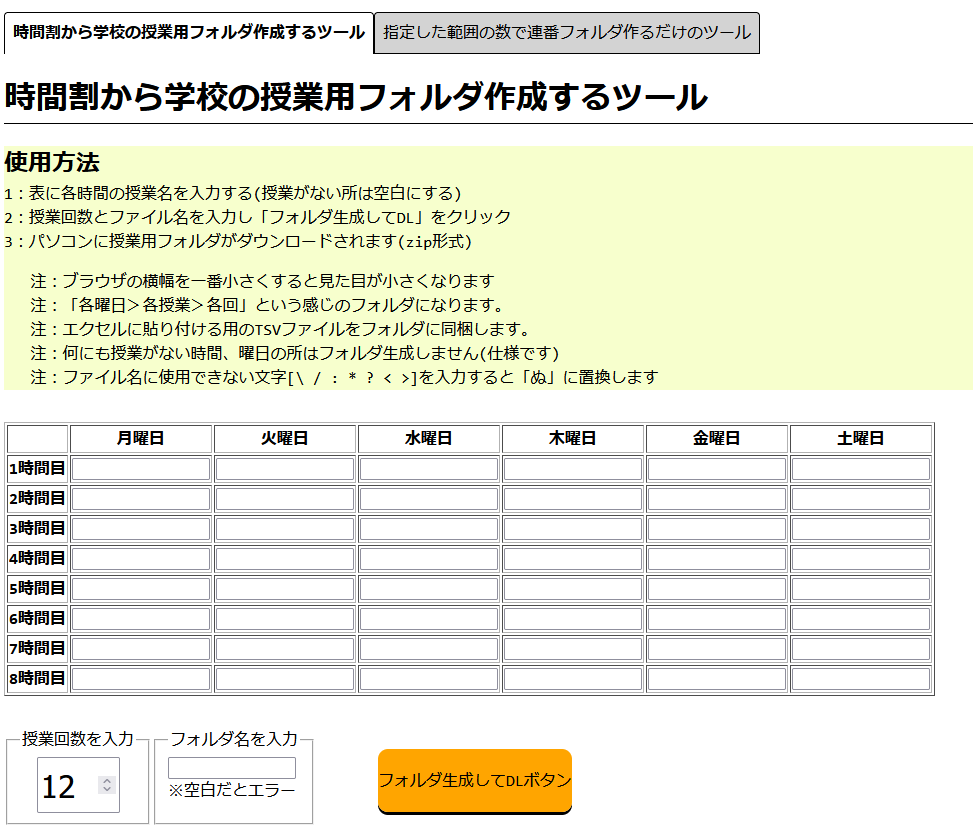
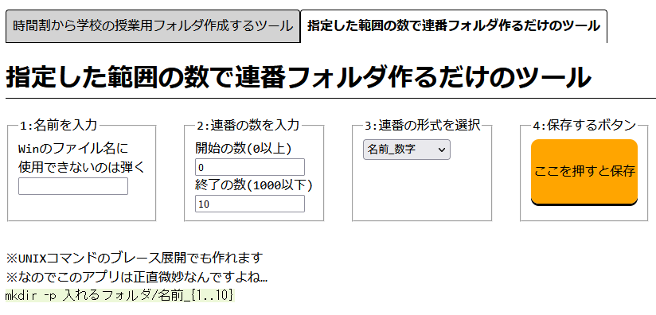

- [機能の説明](#機能の説明)
- [このツールを使う(ウェブ上)](#このツールを使うウェブ上)
- [このツールを動かす方法(ローカル)](#このツールを動かす方法ローカル)
- [使用しているJSのライブラリ](#使用しているjsのライブラリ)
  - [JSZip.js：ZIPファイルの作成](#jszipjszipファイルの作成)
  - [FileSaver.js：ファイルの保存とDL](#filesaverjsファイルの保存とdl)
- [ライセンス](#ライセンス)

 
# 機能の説明 
・時間割から学校の授業用フォルダを作成するツールです。  
・「各曜日＞各授業＞各回」という感じのフォルダを生成します。  
・エクセルに貼り付ける用のTSVも生成します。  
・日本の学校全般を想定して作成しました。  
  

   
・指定した範囲の数で連番フォルダ作るだけのツールも付いてます。  

  

 
# このツールを使う(ウェブ上)
・GitHub Pages↓にデプロイしているのでウェブ上で使えます

 
# このツールを動かす方法(ローカル)
・ファイルを右上の「Code＞Download ZIP」でDLし解凍、  
　中にある「index.html」をブラウザで開くだけで使用可能です。  
・同一生成元ポリシーの制限に引っ掛かる機能は使用してないです。
~~・ライブラリはCDNから読み込んでいるので、オフラインでは使用不可です。~~  
・ライブラリを同梱しているので、オフラインでも使用可能です。

 
# 使用しているJSのライブラリ
これらのライブラリを使用しています。    

## JSZip.js：ZIPファイルの作成
https://github.com/Stuk/jszip  
Copyright (c) 2009-2016 Stuart Knightley, David Duponchel, Franz Buchinger, António Afonso.
 
  
## FileSaver.js：ファイルの保存とDL  
https://github.com/eligrey/FileSaver.js  
Copyright © 2016 Eli Grey.
 
# ライセンス
・[MIT license](https://en.wikipedia.org/wiki/MIT_License)です。自由に改造とかしてくださいな。
